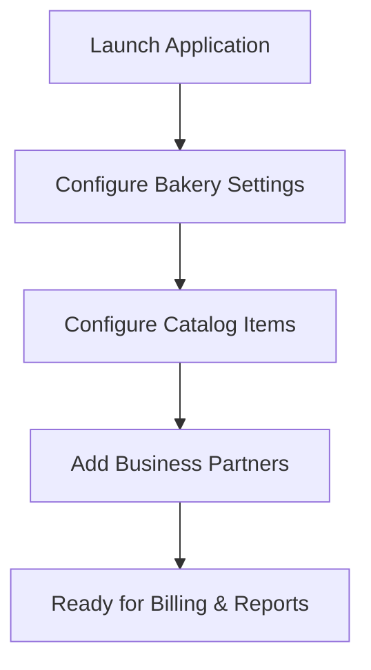

# User Manual: A Plus Invoicing (Bakery POS)

This guide walks you through the operational flow and features of the A Plus Bakery POS & Invoicing Desktop application.
It provides instructions on configuring settings, billing sales, logging purchases, and generating reports.

---

## 1. Initial Setup Flow

When you run the application for the first time, default seed values populate the database.
Follow these steps to customize the application for your bakery:



### 1.1 Configured Bakery Settings
1.  Navigate to **Bakery Settings** in the sidebar.
2.  Enter your bakery store name, address, telephone numbers, and email address.
3.  Add your store GSTIN identifier (this will print at the top of your invoices).
4.  Configure the **Default Invoice Note** (this note displays as a footer on printouts).
5.  Click **Save Configuration** to update the settings.

---

## 2. Managing Inventory (Items Master)

The **Items Master** acts as your central product catalog.

### 2.1 Adding a Product
1.  Click **Items Master** in the sidebar.
2.  Click the **New Product Item** button on the top right.
3.  Fill out the product information:
    *   **Product Code**: Enter a unique SKU identifier (e.g. `IT004`).
    *   **Item Name**: Enter the display name (e.g. `Butter Croissant`).
    *   **Category**: Group the item under Bread, Cakes, Cookies, Savouries, or Drinks.
    *   **GST Tax Slab**: Select the appropriate GST rate (0% Tax-Free, 5%, 12%, 18%, 28%).
    *   **MRP**: Set the Maximum Retail Price.
    *   **Store Price**: Set your selling rate.
    *   **Initial Opening Stock**: Enter the starting inventory quantity.
    *   **Reorder Alert Level**: Set the threshold for low stock warnings.
4.  A live preview of the CODE128 barcode generates automatically at the bottom of the modal.
5.  Click **Save Product** to add the item.

---

## 3. Directory Management (Business Master)

The **Business Master** contains your database of vendors and corporate accounts.

### 3.1 Managing Suppliers & B2B Customers
*   Toggle between the **Suppliers Catalog** and **B2B Wholesale Customers** tabs.
*   Click **New Partner Account** to register a new partner.
*   Specify their legal business name, address, contact representative, and phone number.
*   For B2B customers, enter their GSTIN to ensure correct tax invoicing.
*   **Opening Balance**:
    *   For **Suppliers**: Enter a negative balance if you have outstanding payables (e.g. `-5000` if you owe them money).
    *   For **Customers**: Enter a positive balance if they have outstanding credit due (e.g. `1500` if they owe you money).

---

## 4. Sales and Billing Workflows

### 4.1 Retail POS Billing (Cash Counter)
The **Retail POS** interface is designed for fast, touch-friendly cash counter billing.

```
+-------------------------------------------------+---------------------+
| [Search Bar]                                    | POS Billing Cart    |
| [Category: All | Cakes | Bread | Savouries... ] |                     |
|                                                 | Line Item Details   |
| +------------+  +------------+  +------------+  | [Milk Bread]  x 2   |
| | Milk Bread |  | Choc Cake  |  | Butter Cook|  |                     |
| | ₹ 40.00    |  | ₹ 800.00   |  | ₹ 110.00   |  | Customer Name       |
| +------------+  +------------+  +------------+  | [Walk-in Customer]  |
|                                                 |                     |
| +------------+  +------------+  +------------+  | Payment: Cash | UPI |
| | Croissant  |  | Brownie    |  | Muffins    |  |                     |
| | ₹ 45.00    |  | ₹ 60.00    |  | ₹ 75.00    |  | Subtotal:  ₹ 80.00  |
| +------------+  +------------+  +------------+  | Total Bill: ₹ 84.00  |
|                                                 |                     |
|                                                 | [Hold]   [Checkout] |
+-------------------------------------------------+---------------------+
```

1.  **Select Products**: Tap on any product card to add it to the cart.
2.  **Filter Categories**: Tap the category pills at the top to narrow down the product grid.
3.  **Search Items**: Search by typing item names or SKU codes in the search bar.
4.  **Edit Quantities**: Click `+` or `-` buttons next to items in the cart, or click the red trash bin to remove an item.
5.  **Customer Details**: Enter the customer's name (defaults to "Walk-in Customer").
6.  **Payment Mode**: Choose between Cash, Card, or UPI.
7.  **Order Holds**:
    *   If a customer needs to step away, click **Hold Ticket**. This saves their cart to the **Held Order Tickets** queue.
    *   To retrieve a held order, tap the ticket button under the cart list.
8.  **Checkout**: Click **Checkout** to process the sale. This opens the **Print Invoice** screen.
9.  **Print Receipt**: Tap **Print Document** to open your operating system's print dialog.

### 4.2 B2B GST Invoicing
Use **B2B GST Invoicing** to generate invoices for corporate clients or wholesale orders.
1.  Select the **Business Customer** from the dropdown menu.
2.  Verify the generated invoice number and billing date.
3.  Add items using the **Choose Catalog Item to Add** dropdown menu.
4.  Update item quantities and selling rates directly in the table.
5.  Set the **Payment Received Amount** (enter a partial amount to record the sale on credit).
6.  Click **Save & Print Invoice** to log the sale and generate a printable A4 invoice sheet.

---

## 5. Inward Purchases (Restocking)

Use the **Purchase Inward** screen to log stock received from suppliers.
1.  Select the **Supplier Merchant** from the dropdown menu.
2.  Enter the supplier's invoice reference number and the date of receipt.
3.  Add items using the **Select Item Inwarded** dropdown menu.
4.  Specify the quantity received and the unit cost rate.
5.  Enter the **Paid Amount** (enter a partial amount to record a pending balance).
6.  Click **Save Purchase Invoice** to update your inventory counts and ledger.

---

## 6. Financial Reports & Statements

### 6.1 Dashboard Overview
The **Dashboard Overview** displays high-level metrics for your store:
*   Sales and purchase totals for the current date.
*   Total asset valuation of your current stock.
*   **Weekly Sales Statistics**: An interactive chart showing sales trends over the last 7 days.
*   **Reorder Alerts**: A list of items whose stock levels have fallen below their set reorder limits.

### 6.2 Day Book
The **Day Book** lists all receipts and payments:
1.  Set your start and end dates.
2.  The table displays all purchase payments, retail receipts, and B2B receipts.
3.  Totals for debits, credits, and net cashflow are calculated at the bottom of the page.

### 6.3 Account Ledger
The **Account Ledger** displays transaction histories for specific partners:
1.  Select a supplier or B2B customer from the dropdown menu.
2.  Click **Fetch Statement** to load their account history.
3.  The ledger displays opening balances, invoices, payments, and running outstanding balances.

### 6.4 Exporting to Excel
Click the **Export reports** button at the bottom of the sidebar to save your data:
*   This compiles your profile, catalog items, partner records, stock status, purchase logs, and sales histories.
*   It generates a multi-sheet spreadsheet file and opens a desktop save dialog.
